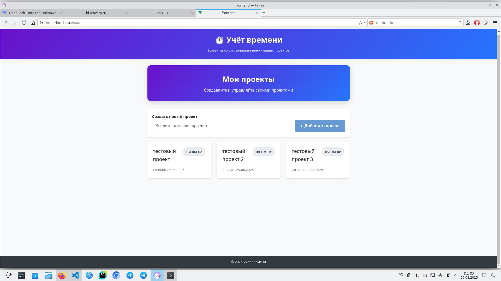
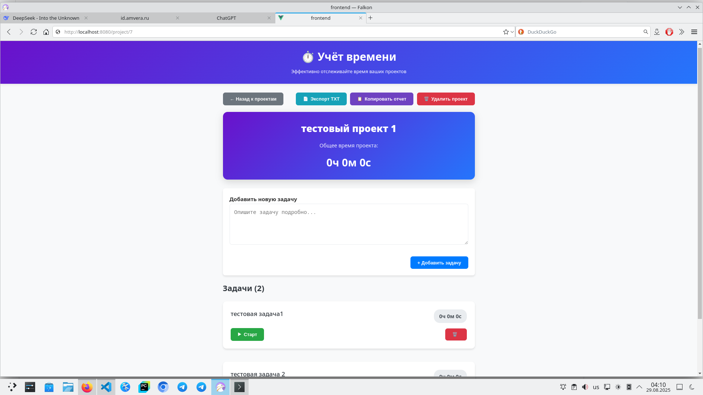

# ⏱️ Timer Tracker


Приложение для учёта времени выполнения проектов и задач.  
Проект сделан для личного использования, но может быть полезен и коллегам — как бэкендерам, так и фронтендерам.  

---

## 📌 Возможности
- Создание проектов и задач
- Запуск/пауза таймера для каждой задачи
- Подсчёт общего времени по проекту
- Экспорт отчётов в TXT или копирование в буфер
- Современный интерфейс на Vue 3 + Vuex
- REST API на FastAPI (Python 3.11, SQLAlchemy)
- База данных MySQL
- Полностью в Docker (frontend + backend + db)

---

## 🛠️ Стек технологий
- **Backend:** FastAPI, SQLAlchemy, Alembic
- **Frontend:** Vue 3, Vue Router, Vuex, Toastification
- **Database:** MySQL 8.0
- **DevOps:** Docker, Docker Compose

---

## 🚀 Запуск проекта

### 1. Клонирование репозитория
```bash
git clone https://github.com/ilmir-muslim/timer_tracker
cd timer_tracker
```

### 2. Запуск через Docker Compose
```bash
docker compose up --build
```

После запуска:
- Backend: [http://localhost:8000](http://localhost:8000)
- Frontend: [http://localhost:8080](http://localhost:8080)
- Swagger (API документация): [http://localhost:8000/docs](http://localhost:8000/docs)

---


## 📸 Скриншоты





### Пересборка
```bash
docker compose up --build -d
```

### Удаление контейнеров и сети
```bash
docker compose down
```

